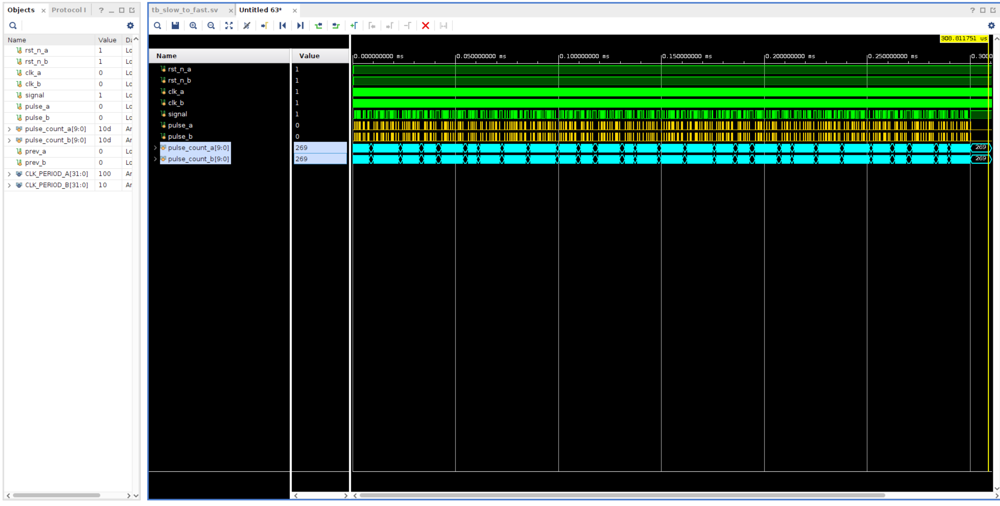
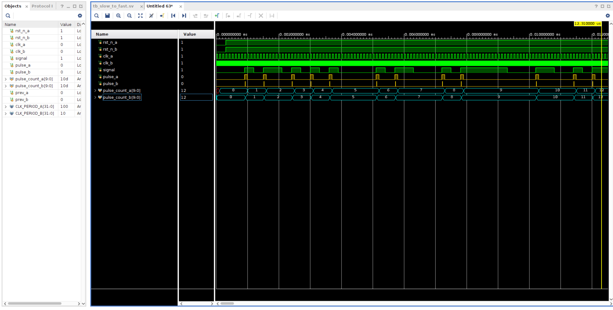
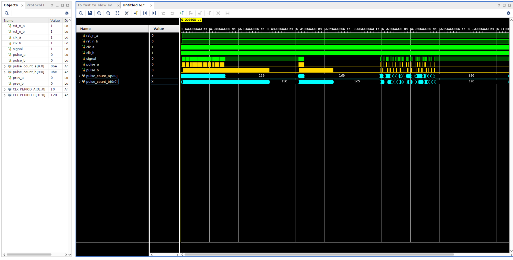
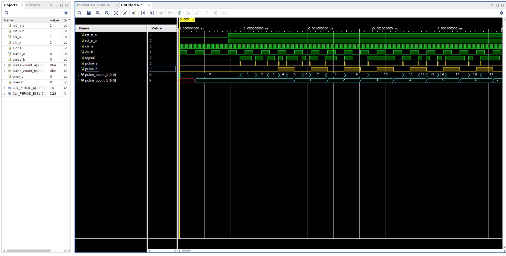

# Pulse Synchronizer

## Slow to Fast Pulse Synchronizer
For the case in which a faster circuit needs to detect the pulses from a slower clock domain and output a pulse in the faster clock domain, I used a double flip flop with an edge detector. The double flip flop gives metastable signals time to stabilize if the faster circuit samples the slower pulse during a transition.

## Fast to Slow Pulse Synchronizer
For the opposite case in which a slower circuit needs to detect pulses from a faster circuit and ouput pulses in the slower clock domain, I used a "count pulser". This pulsing circuit outputs a ready signal to the faster circuit indicating that it is ready to receive a counter. Then, the faster circuit outputs how many pulses have passed since the last transaction and indicates that the new counter is valid. This valid signal is kept high until the slower circuit acknowledges that it has copied the data. Because the ready and acknowledgement signals are coming from a slower clock domain, they also need to pass through a double flip flop edge detector. When the slower circuit receives a valid counter, it pulses that many times (using an FSM) and then it is ready to receive a new counter.

In the image above, it can be shown that the fast-to-slow synchronizer is tested in different scenarios. One is when the fast signal changes moderately fast. The other is when the fast signal is changing almost every period of the fast clock domain, and we see that the slower circuit has more difficulty keeping up. The third batch of pulses happens with the signal changing a lot slower, to the point there is not a difference in the pulses of the fast and slow circuits.

## Additional Considerations
For the fast to slow synchronizer, I assumed that we only care about the pulse count. However, if we also care about the spacing between pulses in the faster clock domain, which would be important if we were synchronizing two buses running on different clock domains, then I would use an asynchronous FIFO. This FIFO would use a similar ready-valid interface as before but instead of storing counters it would store sequences of pulses. For instance, if these sequences were 8 bits, a fast signal that is 11011100 would become 10010000 after edge detection, and this sequence would be passed to the slower circuit (through the FIFO) to also output 10010000 on the slower clock domain.